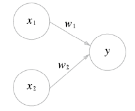

# 발표자료

1. 퍼셉트론
- 퍼셉트론은 다수의 신호를 입력으로 받아 하나의 신호로 출력함.
- 각 입력에 가중치를 곱하고 더함. 이 결과에 따라 출력을 정함.

- 일반 퍼셉트론의 한계는 XOR같은 비선형 영역을 표현할 수 없음.
- 층을 쌓아 다층 퍼셉트론으로 구현하면 비선형 영역을 표현할 수 있음.
2. 신경망
- 신경망은 이전의 퍼셉트론에서 하던 가중치 매개변수를 스스로 학습하는 성질을 지님.

<!-- - 신경망 사진 올리기 -->

- 각 신호에 가중치를 곱한것과 편향을 합쳐 활성화 함수 h(x)를 만듦.
- 활성화 함수는 입력 신호의 총합이 활성화를 일으키는지 정하는 역할을 함. ex) u(t), sigmoid func, ReLU func
- 