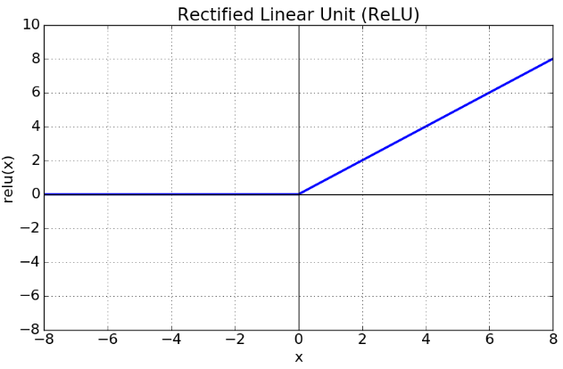
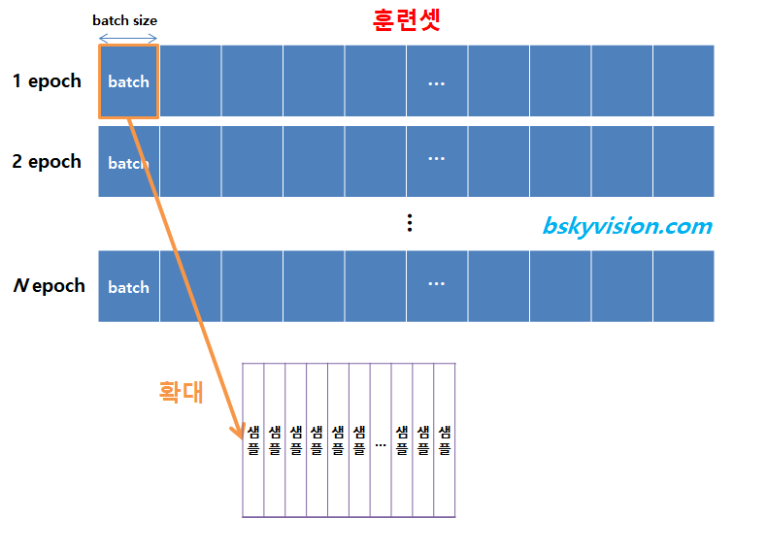

# 발표자료

### 1. 퍼셉트론
- 퍼셉트론은 다수의 신호를 입력으로 받아 하나의 신호로 출력함.
- 각 입력에 가중치를 곱하고 더함. 이 결과에 따라 출력을 정함.

- 일반 퍼셉트론의 한계는 XOR같은 비선형 영역을 표현할 수 없음.
- 층을 쌓아 다층 퍼셉트론으로 구현하면 비선형 영역을 표현할 수 있음.

### 2. 신경망
- 신경망은 이전의 퍼셉트론에서 하던 가중치 매개변수를 스스로 학습하는 성질을 지님.

- 각 신호에 가중치를 곱한것과 편향을 합쳐 활성화 함수 h(x)를 만듦.
- 활성화 함수는 입력 신호의 총합이 활성화를 일으키는지 정하는 역할을 함. ex) 계단함수, 시그모이드, 렐루
- 하지만 시그모이드와 계단함수는 은닉층의 깊이가 깊으면 오차율을 계산하기 어려워짐. (gradient vanishing problem의 발생)
- gradient vanishing을 해결하기위해 렐루의 등장

### 3. 다차원 배열
- 입력신호에 다양한 가중치를 곱하여 은닉층의 입력으로 주려면 행렬의 곱연산이 제격.
- 행렬의 곱연산에서는 첫번째 행렬의 행과 두번째 행렬의 열의 길이가 같아야 함.
- 결과물은 첫번째 행렬의 열 BY 두번째 행렬의 행의 크기를 가짐.

### 4. 소프트맥스란

- 하지만 지수함수가 분자에 존재하여 연산시 불안정 해짐.
- 그러므로 소프트맥스의 입력 중 최댓값을 뺴주면 출력이 0에서 1 사이의 실수로 변함.
- 소프트맥스의 출력을 확률로 해석할 수 있기 때문에 분류 문제에서 매우 강해짐.

### 5. 배치와 에포크

- 전부 업로드 하는 방법도 있지만 배치로 나누어서 학습하면 메모리 관리에 도움이 됨.

### 6. 신경망 학습
- 훈련데이터와 시험데이터로 나눠 학습
- 훈련데이터에만 과도하게 최적화되는 현상인 오버피팅을 피해야 함

### 7. 손실함수
- 출력과 정답을 비교해서 추정값과 정답의 차를 제곱한 후 총합을 구한것이 SSE임.

- 교차 엔트로피 오차는 정답을 옳게 추정했을때 더 낮은 수치를 보여줌.

### 8. 정확도 VS 손실함수
- 직관적인 정확도 대신 손실함수를 사용하는 이유는 미분을 통해 손실함수의 값을 가장 작게하는 매개변수 값을 찾을 수 있기 때문이다.(경사하강법의 제일 낮은 부분)
- 정확도를 지표로 사용하게 되면 대부분의 지점에서 미분값이 0이 되어버리기 때문에 정확도를 사용할 수 없음.

### 9. 경사법
- 미분의 원리를 이용해서 현위치에서 기울어진 방향으로 일정거리만큼 이동하는것을 반복한다.
- 학습률 설정이 중요함. 현위치에서 얼마만큼 이동할지 보폭의 단위라고 생각하면 쉬움.
- 학습률이 너무 낮으면 갱신이 안되고, 학습률이 너무 크면 오히려 발산하는경우가 생김.

### 10. 오차 역전파법
- 가중치 매개변수의 기울기를 효과적으로 계산할 수 있음
- 기존의 수치미분법은 미분을 수행해 비교한 후 낮으면 학습률 만큼 이동하던 과정
- 역전파의 과정 - 신경망의 출력과 정답레이블의 차이를 앞 계층에 전함.

### 11. 확률적 경사하강법 (9. 경사법 보다 더 진보함.)
- 경사하강법은 전체 데이터를 따져서 기울기를 계산.
- 하지만 확률적 경사하강법은 매 step에서 하나의 샘플만 기울기를 계산함. 
- 그러므로 속도에 있어서 더 빠르다는 강점이 있음
- 하지만 노이즈가 커지게 됨.

### 12. 여러가지 경사법 (모멘텀, 에이다그라드, 아담)
- 모멘텀은 가중치를 수정하기 전 이전 방향을 참고해서 같은 방향으로 일정비율만큼 수정되게 함
- 에이다그라드는 많이 변한 변수는 학습률을 낮춰주고, 적게 변한 변수는 학습률을 키움. (능동적으로 보폭 조절)
- 
### 13. 가중치의 초깃값
- 가중치의 초깃값을 설정하는 것도 매우 중요함
- 만약 전부 0으로 한다면? 학습이 하나도 안될것. 왜냐면 오차역전파과정에서 전부 모든 가중치들이 똑같이 업데이트 되기 때문에 일부러 가우시안 랜덤변수로 마구 흩뿌림.
- 표준편차가 1인 랜덤분포로 초기화 한다면 시그모이드같은 활성화 함수 때문에 0과 1로 치우쳐져 gradient vanishing이 발생함. 기울기 소실은 매우 큰 문제를 일으킴.
- 하비에르(xavier) 초깃값 : 표준편차를 sqrt(1/n)으로 정하고 분포시킴. 여기에서 n은 앞 노드의 갯수 시그모이드나 계단함수일때 사용하면 좋음.
- 히(he) 초깃값 : 표준편차를 sqrt(2/n)으로 정하고 분포시킴. 렐루 함수가 활성화 함수일때 효과적.

### 14. 배치정규화
- 이미지를 모델에 넣을때 정규화 하는 과정을 거침.
- 하지만 히든레이어의 입력을 정규화 해주진 않았음
- 감마와 베타를 추가적인 학습 파라미터로 지정해서 매 히든레이어에서 학습.
- BN의 장점으로 학습 속도 개선, 초깃값에 크게 의존하지 않음, 오버피팅 억제.
- 어파인 계층과 활성화계층 사이에 배치정규화 계층을 삽입.

###### 매 계층마다, 배치 마다 감마와 베타값이 존재하는가???

### 15. 드롭아웃
- 드롭아웃이란 뉴런을 임의로 삭제하면서 학습하는 방법.
- 드롭아웃을 왜 할까? 오버피팅을 막기에 효과적이기 때문.

### 16. 합성곱 신경망
- 합성곱(convolution)이란? 두 함수가 있을 때 하나의 함수를 반전시키고 이동하면서 적분하는 기법.
- 구조는 conv, relu, pooling, conv, relu, pooling, conv, relu, affine, softmax 로 구성

### 17. resnet
- 기존 VGG와같은 알고리즘보다 진화한 CNN알고리즘.
- 탄생 배경: 층이 깊어진다 해도 에러가 줄어들지 않고 오히려 증가하기도 한다.
- 특징: 풀링, hiddenfc, dropout을 사용 안함.
- shortcut이 존재함. H(x) = F(X)+ X로 나타낼 수 있다. F(X)가 0이 되는 방향으로 학습을 진행. (x는 변할 수 없는 값이므로)
- identity mapping이 존재. conv1,relu, conv2 relu의 출력과 입력을 비교한 차이값인 나머지(residual)만 학습하면 되기에 연산이 간단 해지고 error값 크기의 측면에서 학습이 더 쉬움.

### 18. validation 
- 데이터를 나눌 때 훈련(train), 검증(validation), 평가(test)로 나눔.(대개 훈련데이터 일부를 검증으로 사용함.)
- 훈련 손실함수와 검증 손실함수를 비교하면 오버피팅 여부를 알 수 있음.

### 19.RNN
- RNN(순환 신경망)은 이전의 activation value가 두번째 출력에 영향을 준다.
- 입력 갯수, 출력개수에 따라서 일대다, 다대일, 다대다로 나누어짐.
- 문제점 : 입력데이터가 매우 크다면 backpropagation을 진행할 때 기울기가 전달이 안됨.
- 위의 문제점을 해결하기 위해 등장한 것이 lstm. 
- lstm은 두개의 벡터와 3개의 게이트가 있음. 기억을 계속 유지시켜줄 수 있게 함.장기상태와 단기상태로 구분.
- GRU의 등장은 lstm을 더욱 간단하게 만들기 위해 등장.
- 하지만 lstm이 있더라도 문장이 길어지면 예측할 수 없어짐.(long term dependency problem), 순차적으로 연산을 하다보니 병렬화가 불가능 해서 연산속도가 느려짐.

### 20. seq2seq
- sequence to sequence를 줄인 말임. sequence는 시계열 데이터를 의미함.
- 다른 말로 인코더-디코더 모델이라고도 함. seq2seq가 encoder,decoder를 사용하기 때문.
- 인코더의 역할: 인코더는 번역에 필요한 정보를 인코딩 한다.
- 디코더의 역할: 인코더가 생성한 정보를 바탕으로 문장을 생성해 출력한다.
- 인코딩의 의미는 임의 길이의 문장을 고정길이 context로 변환하는 작업.
- seq2seq의 문제점으로는 일정 크기의 context를 사용해야 하므로 연산의 낭비가 발생하는 문제점.
- 1.인코더 개선: 고정길이의 context를 이용하는 것이 아닌 가변길이의 encoder를 사용함. 시각별 RNN(lstm) 계층의  은닉상태 벡터를 모두 이용함.
- 2.디코더 개선: attention계층 사용 매 시점마다 컨텍스트 벡터를 참고하는 것.

### 21. Transformer
- 기존의 RNN의 단점을 보완하고자 seq2seq구조에서 오직 attention만 사용하는 것을 Transformer라고 함.